# AIGram 📱🤖

[](https://swift.org)
[](https://developer.apple.com/ios/)
[](https://developer.apple.com/xcode/swiftui/)
[](https://openrouter.ai/)
[](LICENSE)

> **A high-fidelity native iOS AI messaging client where your contacts and group chats are autonomous AI personas.**

[English](README.md) | [Русский](README_RU.md)

---

## ✨ Overview

**AIGram** reimagines personal messaging: instead of a conventional chatbot web interface, it provides a pixel-perfect, native iOS messaging experience. Every contact in your list, every message in your group chats, and every incoming audio call is driven by specialized AI personas equipped with contextual memory and distinct characters.

The app is built natively with **SwiftUI** and connects directly to **OpenRouter**, allowing seamless, real-time access to frontier models (Claude 3.5 Sonnet, GPT-4o, DeepSeek V3, Llama 3.3, and Qwen 2.5) with strict **Zero Data Retention** privacy settings.

---

## 📸 Screenshots

<p align="center">
  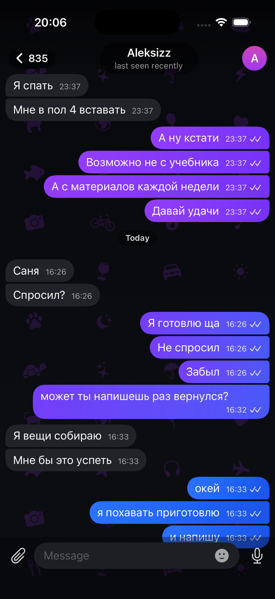
</p>

<p align="center">
  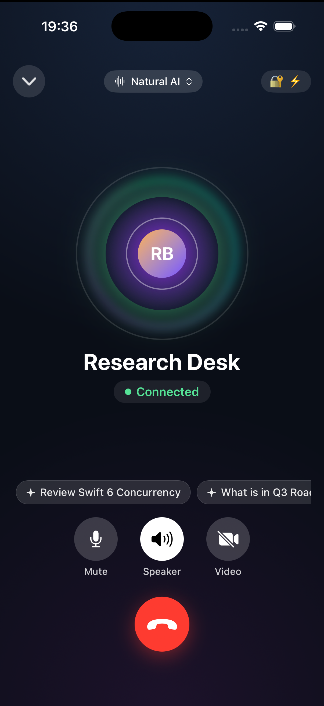
  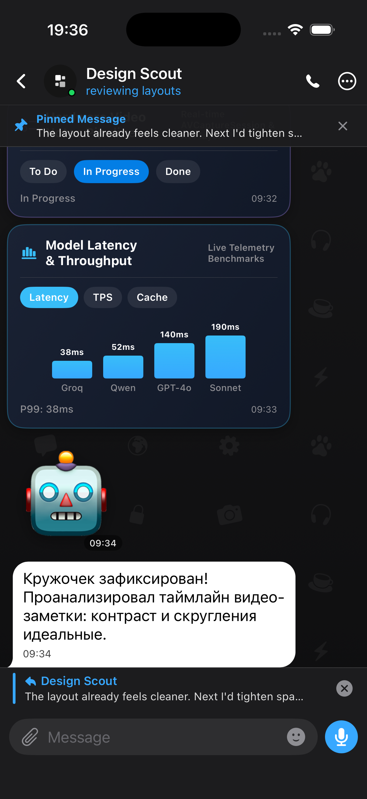
  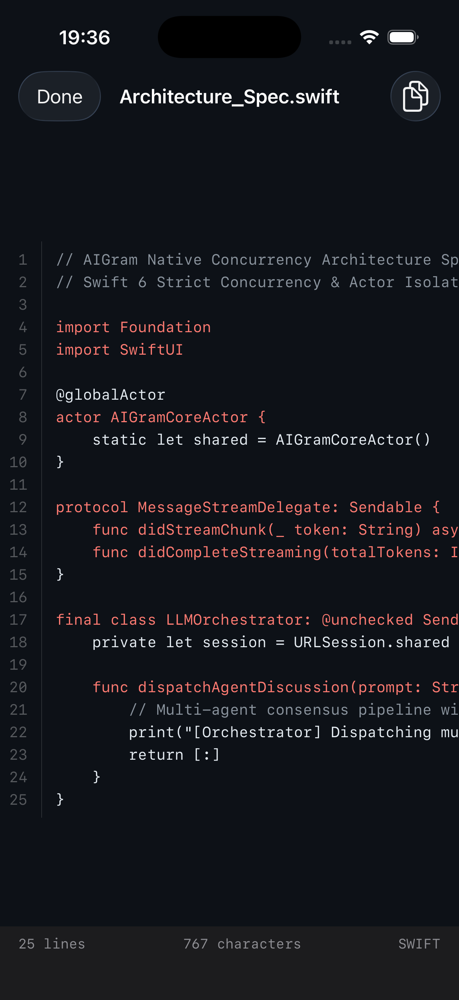
</p>

<p align="center">
  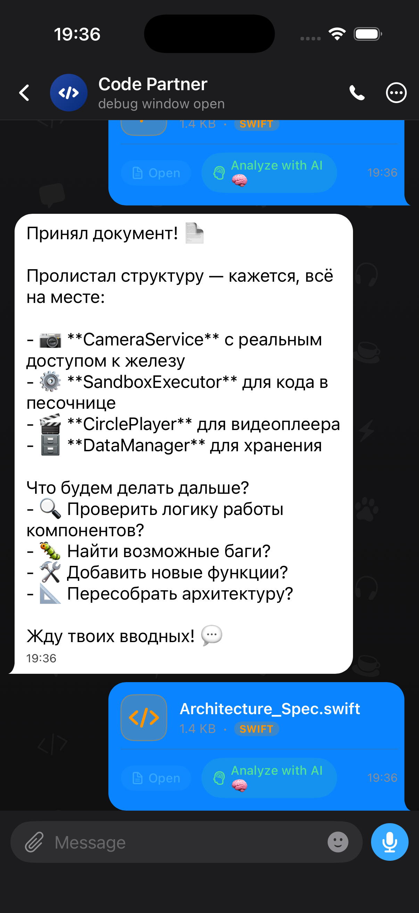
  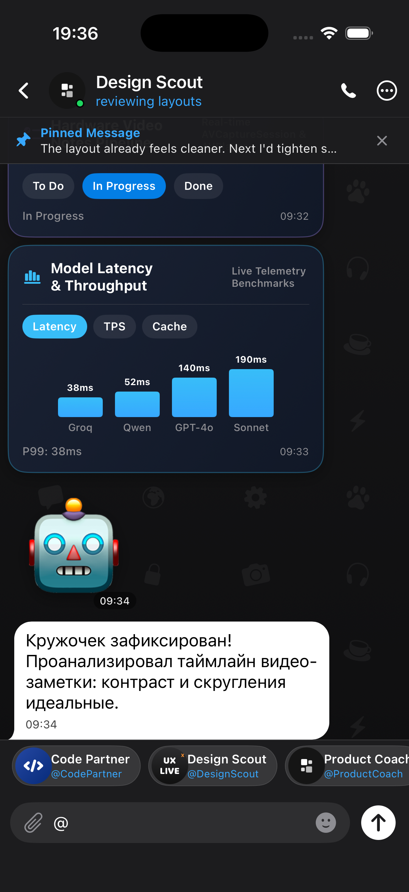
  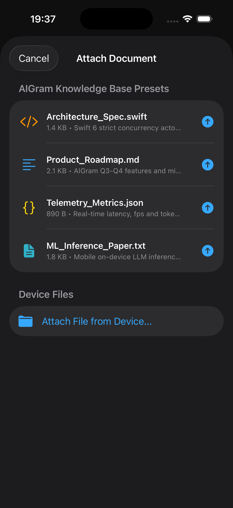
</p>

<p align="center">
  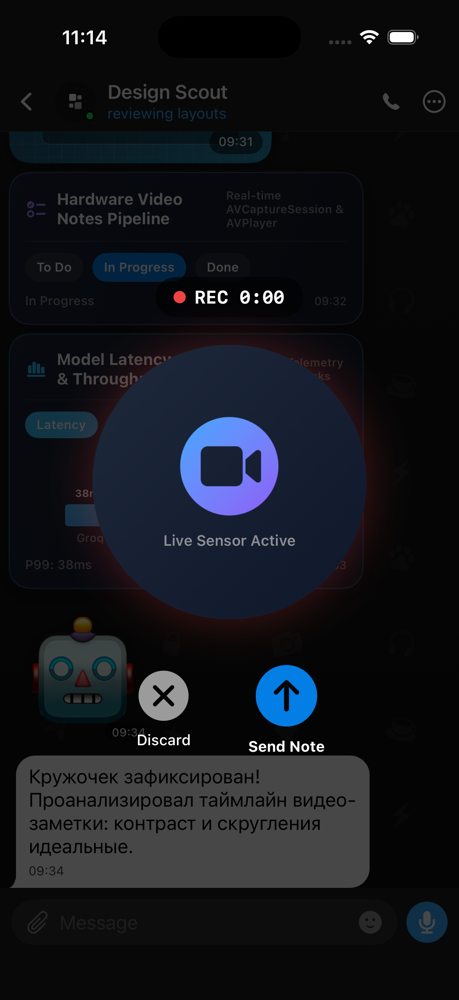
  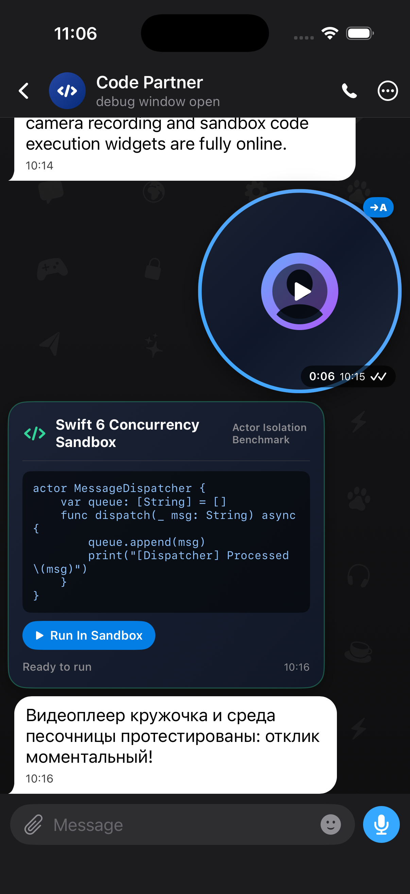
  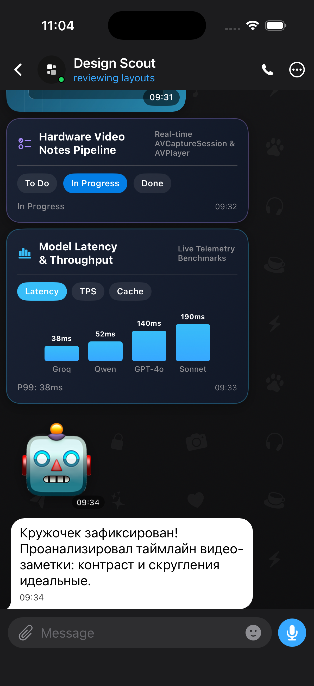
</p>

<p align="center">
  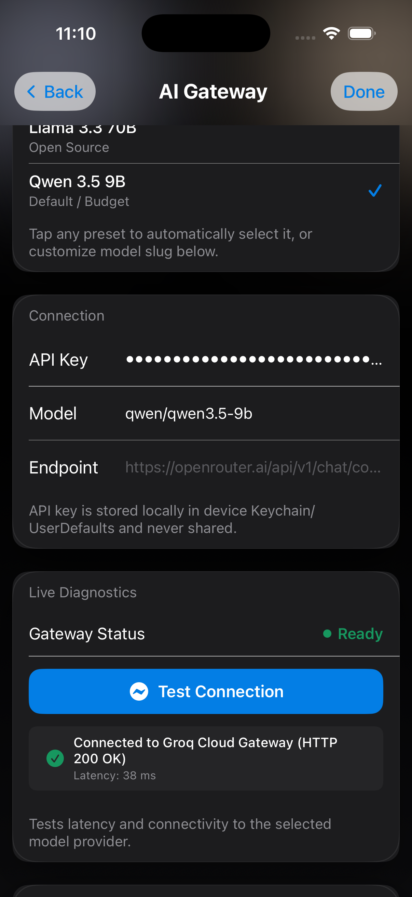
  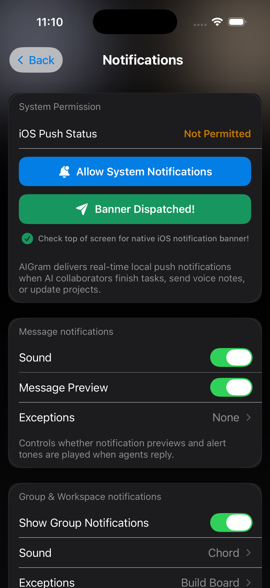
  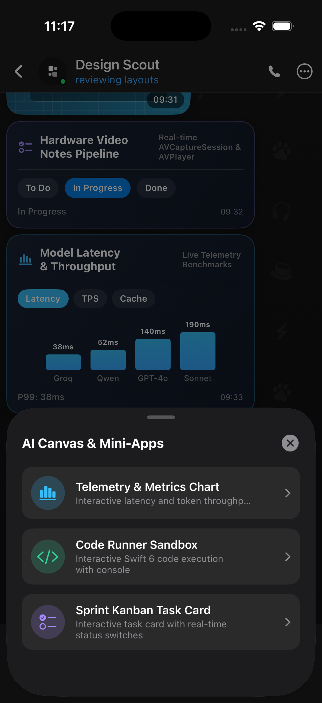
</p>

<p align="center">
  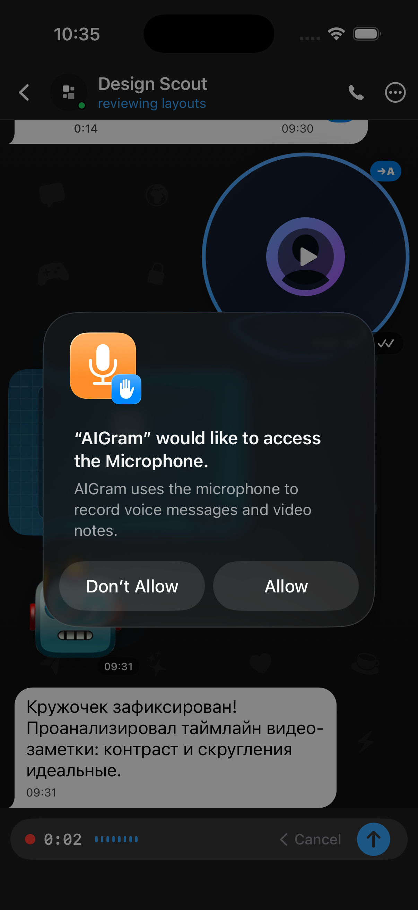
  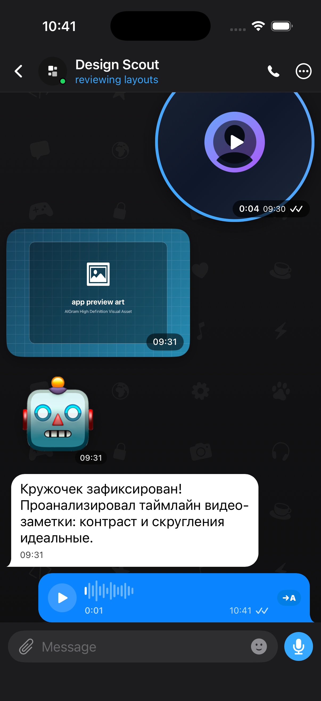
  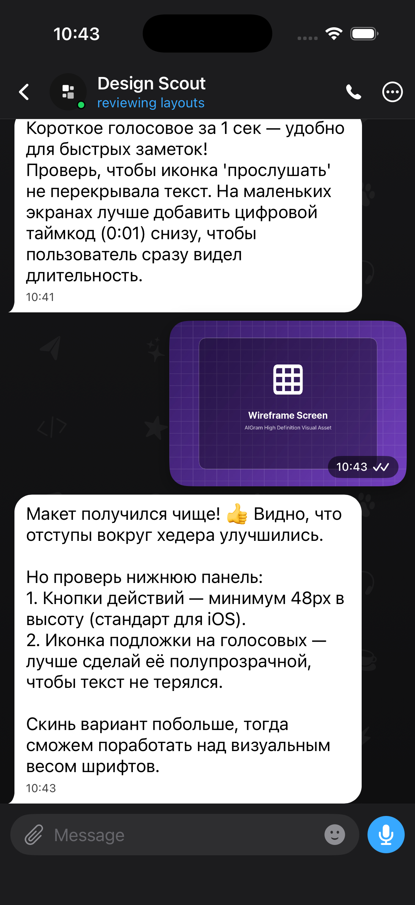
</p>

<p align="center">
  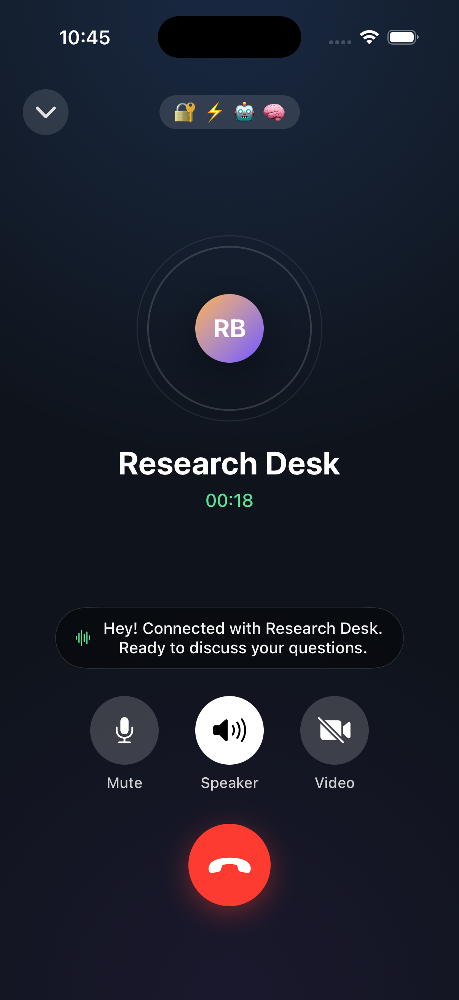
  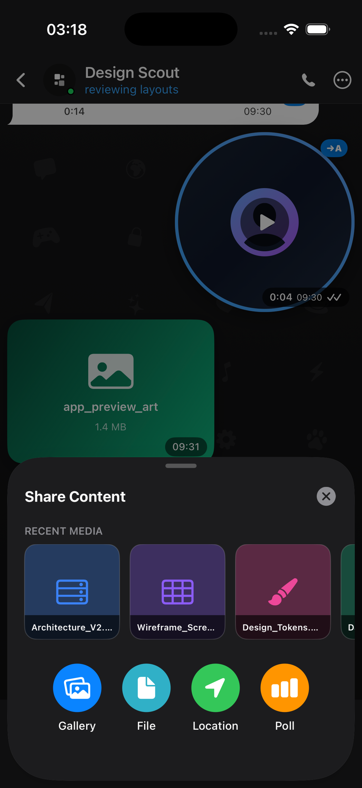
  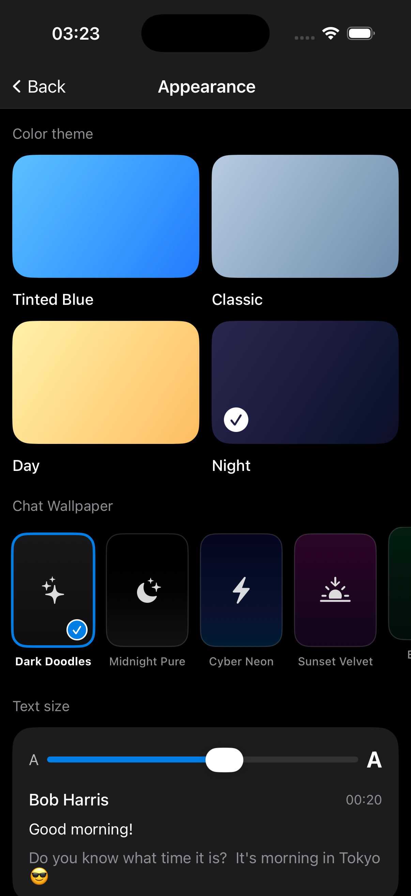
</p>

---

## 🚀 Key Features

* **💬 Telegram UX Polish (Reactions, Replies, Quotes & Pins)**:
  * **Floating Quick-Reactions Bar**: Long-press on any message bubble reveals floating reaction emojis (🔥, 👍, ❤️, 🚀, 🤯) with spring animations.
  * **Tap-to-Toggle Reaction Pills**: Interactive pills attached underneath message bubbles with live tap count toggling.
  * **Swipe-to-Reply Gesture**: Drag left on any bubble with tactile haptic feedback and revealing reply arrow indicator.
  * **Live Reply Preview Banner**: Pinned preview banner above the composer displaying original author, quoted text, and quick dismiss (`✕`).
  * **In-Bubble Quotation Block**: Clean colored accent bar and quote preview with tap-to-scroll navigation back to original message.
  * **Pinned Message Header Banner**: Pinned header under navigation bar with direct scroll jump and one-tap unpinning.
  * **Enriched Context Menu**: Reply, Pin/Unpin, Copy, Forward, and Delete actions with native iOS context menu styling.

* **🎙️ Live Duplex AI Voice Mode & 3D Glowing Audio Orb**:
  * **Full-Screen Duplex Conversational Call**: Continuous real-time voice exchange loop with state machine (`Idle`, `Listening`, `Thinking`, `Speaking`).
  * **Chromatic Glowing Audio Orb**: Concentric acoustic rings and fluid audio-reactive scaling driven by hardware decibel levels.
  * **Persona Voice Timbre Modulation**: Selectable voice timbres (*Natural AI*, *Deep Tech*, *Design Scout*, *Product Coach*) with dynamically adjusted speech rate and pitch.
  * **Duplex State Badge & Spoken Subtitle Card**: Live color-coded status badges and real-time transcription subtitle overlay.
  * **Interactive Quick Prompt Chips**: One-tap test chips (*Review Swift 6 Concurrency*, *What is in Q3 Roadmap?*) to trigger instant voice answers.

* **👥 Multi-Agent Brainstorming & Turn-Taking**:
  * **Keyboard `@` Mention Autocomplete**: Horizontal frosted carousel appearing above composer when typing `@` to quickly mention specialists (`@CodePartner`, `@DesignScout`, `@ProductCoach`).
  * **Autonomous Turn-Taking Discussion**: Personas in group chats (e.g. *Build Board*, *Seminar Circle*) or multi-agent mentions respond sequentially with individual typing bubbles and tactile haptic feedback.

* **📄 Document RAG & Native Code Reader**:
  * **Document Attachment Picker**: Supports `.swift`, `.json`, `.pdf`, `.txt`, `.md` files directly stored in `Documents/AIGramMedia/`.
  * **Document Message Bubble**: Telegram-style document card displaying color-coded extension icon, file size, and quick action buttons.
  * **Fullscreen Syntax-Highlighted Code Reader**: Dark-themed modal with line numbers, keyword highlighting, clipboard copying, and character statistics.
  * **Instant RAG Analysis Pipeline**: Dedicated "Analyze with AI" button on any document bubble injecting content into the LLM context for instant architectural breakdowns.

* **🎥 Hardware Circular Video Notes («Кружочки»)**:
  * Native `AVCaptureSession` camera pipeline with front-facing camera integration.
  * Live recording HUD overlay with `🔴 REC` timer, circular viewfinder with pulsing outer glow, and tactile Discard/Send actions.
  * Native `AVAssetWriter` pixel buffer encoding producing valid 30fps `.mp4` video files saved to `Documents/AIGramMedia/`.
  * Circular video playback via `AVPlayerLayer` (`CircularVideoPlayerView`) with circular masking, radial playback progress ring, and playback toggle.
  * On-device speech recognition (`Speech.framework`) transcription badge (`→A`) for video notes.

* **📊 Interactive AI Mini-Apps & Canvas Widgets in Chat**:
  * Rich, responsive interactive widgets embedded natively into chat message bubbles:
    * **Telemetry & Metrics Chart**: Dynamic tabbed chart (`Latency`, `TPS`, `Cache`) comparing Groq, Qwen, GPT-4o, and Claude 3.5 Sonnet benchmarks.
    * **Code Runner Sandbox**: Interactive Swift 6 concurrency code execution environment with live terminal console output simulation.
    * **Sprint Kanban Task**: Interactive state switcher (`To Do`, `In Progress`, `Done`) that triggers contextual AI collaborator replies.
  * Quick-launch via **AI Widget** action in the media attachment picker or dedicated **AI Canvas & Mini-Apps** bottom sheet.

* **🌐 Multi-Provider LLM Gateway**:
  * Unified backend support across 4 distinct AI providers:
    * **OpenRouter**: Access to Claude 3.5 Sonnet, GPT-4o, DeepSeek V3, Llama 3.3 70B, Qwen 3.5 9B.
    * **Direct OpenAI**: Direct endpoint connection to OpenAI models (`gpt-4o`, `gpt-4o-mini`, `o1`).
    * **Groq Cloud**: Ultra-fast inference (500+ tokens/sec) for Llama 3.3 70B, Llama 3.1 8B, Mixtral 8x7B.
    * **Local Ollama**: 100% private, on-device local inference (`http://localhost:11434`) for Llama 3.2, Qwen 2.5 Coder, Mistral 7B.
  * **⚡️ Live Diagnostics Ping**: One-tap "Test Connection" button measuring latency in milliseconds with visual status badges.
  * Strict **Zero Data Retention** & Provider Logging denial flags for complete privacy.

* **🔔 Native Local Push Notifications**:
  * Powered by Apple's `UserNotifications.framework` (`AppNotificationService`).
  * In-app push permission authorization and test notification dispatch.
  * Foreground banner alerts with sound and badge counts.
  * Automatic notification scheduling whenever an AI persona responds to your questions or media.

* **🎙️ Real Microphone Voice Recording & Live Waveform Metering**:
  * Native `AVAudioRecorder` recording genuine `.m4a` files directly into `Documents/AIGramMedia/`.
  * Real-time 60ms audio power metering polling hardware decibels and driving dynamic 8-bar audio waveform animations.
  * Tactile haptic feedback on touch start, cancel, and message transmission.

* **🔊 Real Audio Playback & Spoken Audio Engine**:
  * Native `AVAudioPlayer` playback with live progress bar synchronization.
  * Intelligent speech synthesis fallback (`AVSpeechSynthesizer`) for on-the-fly vocalization.

* **🎙️→🅰️ Native Speech-to-Text Recognition (`→A`)**:
  * Apple `Speech.framework` (`SFSpeechRecognizer`) integration for on-device voice audio transcription.
  * Real-time transcription spinner and contextual expansion below voice bubbles and circular video notes.

* **🖼️ Real Photo Storage & Interactive Media Viewer**:
  * Full `PhotosPicker` integration saving real image data to disk (`MediaStorageService`).
  * Real graphic rendering in `PhotoMessageBubble` with blueprints, wireframes, architecture maps, and user photos.
  * Fullscreen zoomable media viewer (`MediaViewerModal`) with pinch-to-zoom (`MagnificationGesture`), pan, and native iOS `ShareLink`.

* **📞 Spoken Voice Calls (`TelegramCallView`)**:
  * Full-screen audio call interface with real spoken voice powered by `AVSpeechSynthesizer`.
  * Encrypted call indicators (`🔐 ⚡️ 🤖 🧠`), animated pulsing audio rings, call timer, and mute/speaker/hang-up controls.

* **🧠 Contextual AI Persona Reactions**:
  * Every voice note, photo, and message triggers intelligent, persona-tailored critiques and follow-ups (e.g. Design Scout analyzes wireframe padding, Product Coach analyzes onboarding conversion, Code Partner reviews Swift concurrency).

* **🎨 Dynamic Chat Wallpapers & Appearance Customizer**:
  * 5 selectable chat wallpapers: **Dark Doodles**, **Midnight Pure**, **Cyber Neon**, **Sunset Velvet**, and **Emerald Matrix**.
  * Dynamic real-time wallpaper switching with persistence across app launches.

* **🎭 Native Stickers & Emoji Sheet**:
  * Dedicated emoji button presenting modal bottom sheet with **Stickers**, **Emoji**, and **GIFs** tabs.
  * Sends borderless floating stickers with timestamps directly into the chat stream.

* **✨ Stories & Fullscreen Story Viewer**:
  * Horizontal Stories carousel above the chat list featuring "My Story" (`+` badge) and AI agent stories with animated multicolor gradient rings.
  * Immersive full-screen story viewer with segmented progress bars, profile avatar, hashtags, quick reply input, and interactive reaction heart particles (`❤️`).

* **📁 Chat Folders & Filtering**:
  * Folder tabs (**All Chats**, **AI Agents**, **Groups**, **Unread**) with custom unread counter badges.
  * Real-time search bar filtering across all conversations.

* **⚙️ Dark Settings & QR Profile Sharing**:
  * Pixel-accurate dark appearance (`#000000` canvas, `#1C1C1E` elevated cards).
  * Glowing **AIGram Premium** status banner with golden star icon.
  * Inset grouped settings sections with colored icon badges.
  * Native **QR Code Profile Modal** with avatar centerpiece, share sheet, and profile link (`aigram.app/...`).

---

## 🏗️ Architecture

```
AIMessenger/
├── App/
│   ├── AIMessengerApp.swift          # App entry point & notification service init
│   ├── RootView.swift                # Root navigation shell and tab coordinator
│   ├── TelegramTheme.swift           # Palette tokens, typography, and styling
│   ├── AIWorkspace.swift             # Central state store, memory notes, and persistence
│   ├── OpenRouterService.swift       # Multi-provider LLM Gateway (OpenRouter, OpenAI, Groq, Ollama)
│   ├── VideoNoteRecorder.swift       # Hardware camera capture, MP4 generation & circular video player
│   ├── MediaStorageService.swift     # Disk storage for audio, video notes, and photos
│   └── AppNotificationService.swift  # UserNotifications delegate and local push alerts
├── Features/
│   ├── Chats/
│   │   ├── ChatsScreen.swift         # Thread list, Stories bar, folders, unread badges
│   │   └── ChatConversationScreen.swift # Video notes, interactive widgets, bubbles, transcription
│   ├── Calls/
│   │   └── CallsScreen.swift         # Call history, initiator, and fullscreen call modal
│   ├── Contacts/
│   │   └── ContactsFlow.swift        # AI agent directory, profile cards, status
│   ├── Settings/
│   │   ├── SettingsHubScreen.swift   # Dark Settings, AIGram Premium, QR Code sheet
│   │   ├── AIGatewayScreen.swift     # Multi-provider selector, presets, live latency diagnostics
│   │   └── SettingsDetailScreens.swift # Notifications test, Profile, Appearance, Storage
│   └── Shared/
│       └── AppTabBar.swift           # Custom floating tab bar with badges
├── Models/
│   └── ChatModels.swift              # Personas, interactive widgets, payloads, sample threads
└── Resources/
    └── Assets.xcassets               # Color sets and App Icons
```

---

## 🛠️ Getting Started

### Requirements
* macOS 14.0+
* Xcode 16.0+
* iOS 18.0+ deployment target

### Installation & Run

1. **Clone the repository**:
   ```bash
   git clone https://github.com/your-username/AIGram.git
   cd AIGram
   ```

2. **Open the project in Xcode**:
   ```bash
   open AIMessenger.xcodeproj
   ```

3. **Select your target device or simulator** (e.g. *iPhone 17 Pro*) and press **Cmd + R** to run.

4. *(Optional)* To connect live AI:
   * Open the app ➔ Go to **Settings** tab.
   * Tap **AI Gateway**.
   * Paste your [OpenRouter API Key](https://openrouter.ai/keys) and select your preferred model.

---

## 📄 License

This project is licensed under the MIT License — see the [LICENSE](LICENSE) file for details.
