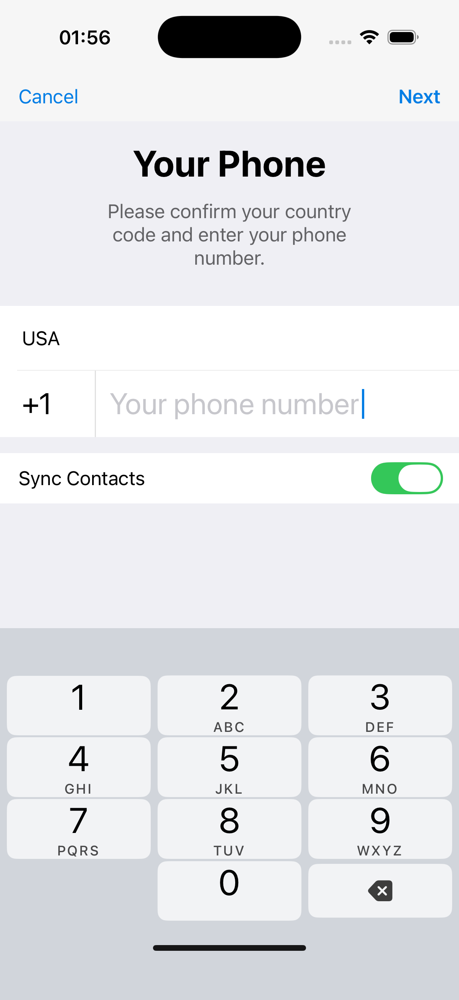
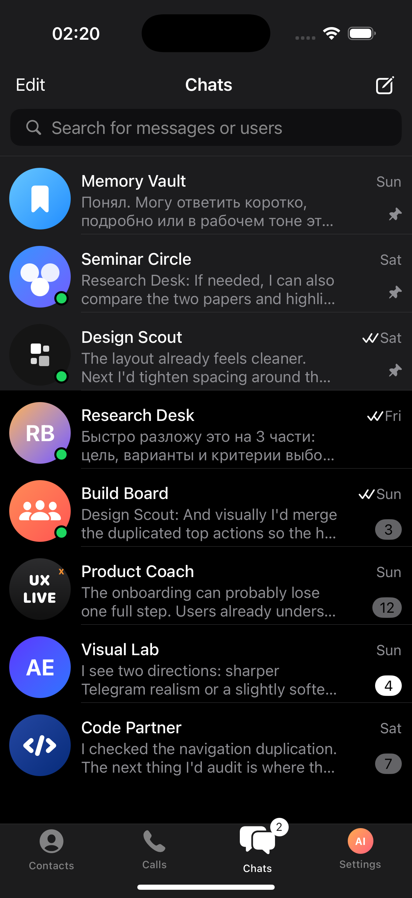

# AIMessenger 📱🤖

[](https://swift.org)
[](https://developer.apple.com/ios/)
[](https://developer.apple.com/xcode/swiftui/)
[](https://openrouter.ai/)
[](LICENSE)

> **Нативный iOS-клиент в дизайне Telegram, где каждый контакт и участник группового чата — автономная AI-личность.**

[English](README.md) | [Русский](README_RU.md)

---

## ✨ О проекте

**AIMessenger** переосмысляет общение с искусственным интеллектом: вместо скучных веб-интерфейсов чат-ботов вы получаете полноценный, пиксель-в-пиксель точный клиент Telegram. Каждый контакт в списке, каждый участник рабочего чата и каждый входящий аудиозвонок управляются специализированными ИИ-персонами с контекстной памятью и уникальным характером.

Приложение разработано на **SwiftUI** под iOS 18 и подключается к **OpenRouter API**, предоставляя доступ к топовым нейросетям (Claude 3.5 Sonnet, GPT-4o, DeepSeek V3, Llama 3.3, Qwen 2.5) с поддержкой строгих настроек приватности **Zero Data Retention**.

---

## 📸 Скриншоты

<p align="center">
  
  
  
</p>

---

## 🚀 Ключевые возможности

* **Настоящий UI & UX Telegram**:
  * Фирменная темная палитра Telegram iOS.
  * Бабблы сообщений с отметками времени и двухэтапными галочками доставки (`✓` ➔ `✓✓`).
  * Анимированный статус **«печатает...»** (`typing...`) в шапке чата во время генерации ответа.
  * Кастомный плавающий таббар, бейджи непрочитанных и поиск по диалогам.

* **📞 Интерактивный Telegram-аудиозвонок**:
  * Нажатие на трубку в чате или во вкладке «Звонки» открывает полноэкранный экран вызова Telegram.
  * Пульсирующие звуковые волны вокруг аватара, 4 эмодзи сквозного шифрования (`🔐 ⚡️ 🤖 🧠`).
  * Секундомер длительности вызова, кнопки отключения микрофона, динамика и сброса.
  * Интерактивная имитация голосового приветствия собеседника.

* **👥 Групповые чаты и мульти-агентные дискуссии**:
  * В группах **Build Board** и **Seminar Circle** боты общаются не только с пользователем, но и спорят друг с другом, дополняя ответы коллег.

* **🌐 Универсальный AI Gateway (OpenRouter)**:
  * Быстрое переключение моделей в один тап:
    * **Claude 3.5 Sonnet** (Архитектура, код, аналитика)
    * **GPT-4o** (Универсальный интеллект)
    * **DeepSeek V3** (Высокая скорость и экономичность)
    * **Llama 3.3 70B** (Флагманский Open-Source)
    * **Qwen 3.5 9B** (Дефолтная быстрая модель)
  * Поле для ввода любого кастомного slug с OpenRouter.

* **🛡️ Конфиденциальность и Zero Data Retention**:
  * Тумблеры ZDR и запрета логирования провайдерами прямо в настройках.
  * Все токены и история сохраняются локально на устройстве в защищенном хранилище.

* **⚡️ Работает без API-ключа (Offline Fallback)**:
  * При первом запуске или отсутствии ключа боты используют богатые локальные сценарии ответов, что позволяет любому ревьюеру протестировать проект сразу после клонирования.

---

## 🛠️ Запуск проекта

1. Склонируйте репозиторий:
   ```bash
   git clone https://github.com/your-username/AIMessenger.git
   cd AIMessenger
   ```
2. Откройте проект в Xcode:
   ```bash
   open AIMessenger.xcodeproj
   ```
3. Выберите симулятор (например, *iPhone 16 Pro*) и нажмите **Cmd + R**.
4. *(Опционально)* Для подключения живого ИИ перейдите во вкладку **Settings ➔ AI Gateway** и введите ключ [OpenRouter API Key](https://openrouter.ai/keys).

---

## 📄 Лицензия

MIT License — подробности в файле [LICENSE](LICENSE).
